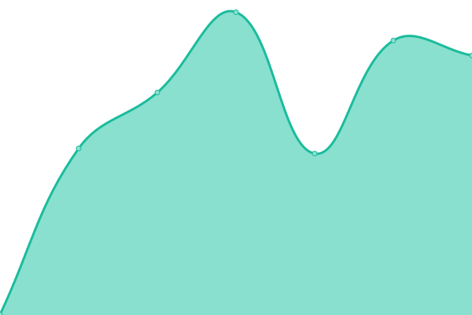

# [📈 Live Status](https://www.skrr.eu.org): <!--live status--> **🟧 Partial outage**

This repository contains the open-source uptime monitor and status page for [LonelyJupiter](https://www.skrr.eu.org), powered by [Upptime](https://github.com/upptime/upptime).

With [Upptime](https://upptime.js.org), you can get your own unlimited and free uptime monitor and status page, powered entirely by a GitHub repository. We use [Issues](https://github.com/LonelyJupiter/UPPTIME/issues) as incident reports, [Actions](https://github.com/LonelyJupiter/UPPTIME/actions) as uptime monitors, and [Pages](https://www.skrr.eu.org) for the status page.

<!--start: status pages-->
<!-- This summary is generated by Upptime (https://github.com/upptime/upptime) -->
<!-- Do not edit this manually, your changes will be overwritten -->
<!-- prettier-ignore -->
| URL | Status | History | Response Time | Uptime |
| --- | ------ | ------- | ------------- | ------ |
|  jp | 🟩 Up | [jp.yml](https://github.com/LonelyJupiter/UPPTIME/commits/HEAD/history/jp.yml) | 

 740ms
     
 | 

<a href="https://www.skrr.eu.org/history/jp">100.00%</a>
    

|  sg | 🟥 Down | [sg.yml](https://github.com/LonelyJupiter/UPPTIME/commits/HEAD/history/sg.yml) | 

 797ms
     
 | 

<a href="https://www.skrr.eu.org/history/sg">94.72%</a>
    

|  hk1 | 🟥 Down | [hk1.yml](https://github.com/LonelyJupiter/UPPTIME/commits/HEAD/history/hk1.yml) | 

 0ms
     
 | 

<a href="https://www.skrr.eu.org/history/hk1">0.00%</a>
    

|  hk2 | 🟩 Up | [hk2.yml](https://github.com/LonelyJupiter/UPPTIME/commits/HEAD/history/hk2.yml) | 

 875ms
     
 | 

<a href="https://www.skrr.eu.org/history/hk2">99.67%</a>
    

|  cac | 🟥 Down | [cac.yml](https://github.com/LonelyJupiter/UPPTIME/commits/HEAD/history/cac.yml) | 

 332ms
     
 | 

<a href="https://www.skrr.eu.org/history/cac">13.74%</a>
    

|  eu1 | 🟥 Down | [eu1.yml](https://github.com/LonelyJupiter/UPPTIME/commits/HEAD/history/eu1.yml) | 

 707ms
     
 | 

<a href="https://www.skrr.eu.org/history/eu1">0.00%</a>
    

|  eu2 | 🟩 Up | [eu2.yml](https://github.com/LonelyJupiter/UPPTIME/commits/HEAD/history/eu2.yml) | 

 3827ms
     
 | 

<a href="https://www.skrr.eu.org/history/eu2">100.00%</a>
    

|  eu3 | 🟩 Up | [eu3.yml](https://github.com/LonelyJupiter/UPPTIME/commits/HEAD/history/eu3.yml) | 

 1508ms
     
 | 

<a href="https://www.skrr.eu.org/history/eu3">95.12%</a>
    

|  la | 🟩 Up | [la.yml](https://github.com/LonelyJupiter/UPPTIME/commits/HEAD/history/la.yml) | 

 366ms
     
 | 

<a href="https://www.skrr.eu.org/history/la">100.00%</a>
    

|  jpvir | 🟥 Down | [jpvir.yml](https://github.com/LonelyJupiter/UPPTIME/commits/HEAD/history/jpvir.yml) | 

 309ms
     
 | 

<a href="https://www.skrr.eu.org/history/jpvir">59.32%</a>
    

|  kr | 🟩 Up | [kr.yml](https://github.com/LonelyJupiter/UPPTIME/commits/HEAD/history/kr.yml) | 

 713ms
     
 | 

<a href="https://www.skrr.eu.org/history/kr">100.00%</a>
    

|  sggu | 🟥 Down | [sggu.yml](https://github.com/LonelyJupiter/UPPTIME/commits/HEAD/history/sggu.yml) | 

 0ms
     
 | 

<a href="https://www.skrr.eu.org/history/sggu">0.00%</a>
    

<!--end: status pages-->

[**Visit our status website →**](https://www.skrr.eu.org)

## 📄 License

- Powered by: [Upptime](https://github.com/upptime/upptime)
- Code: [MIT](./LICENSE) © [LonelyJupiter](https://www.skrr.eu.org)
- Data in the `./history` directory: [Open Database License](https://opendatacommons.org/licenses/odbl/1-0/)
